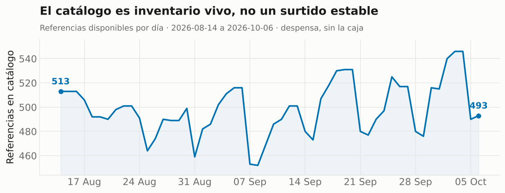
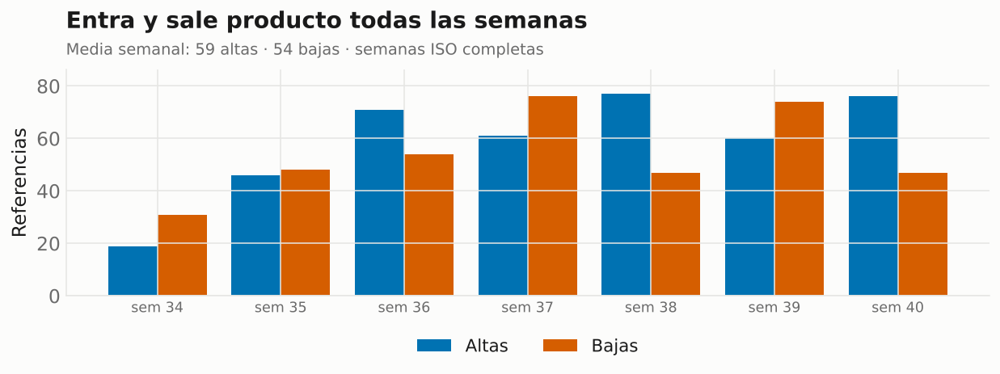
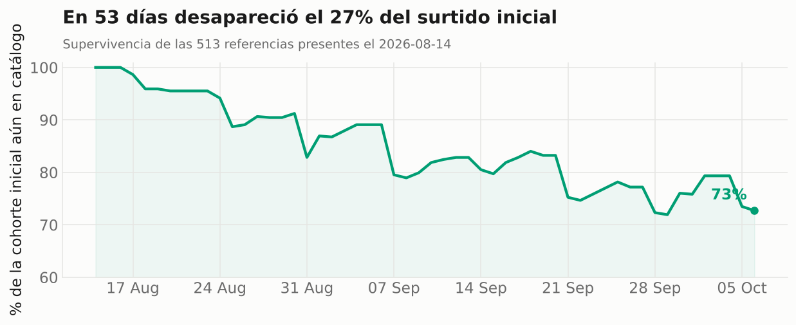
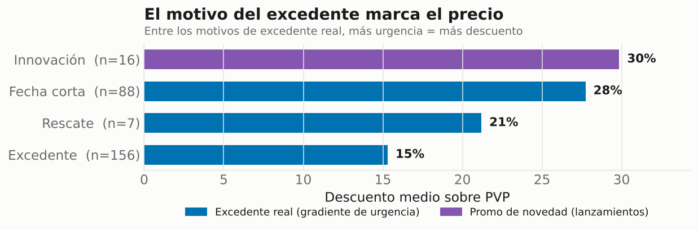
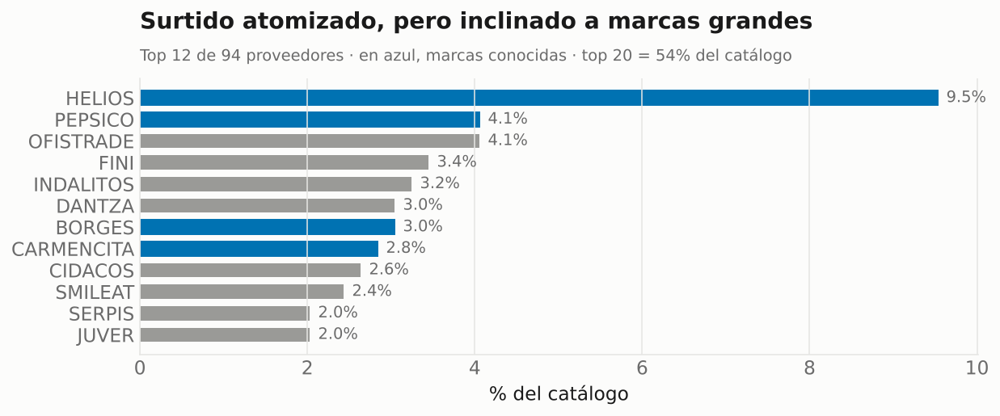
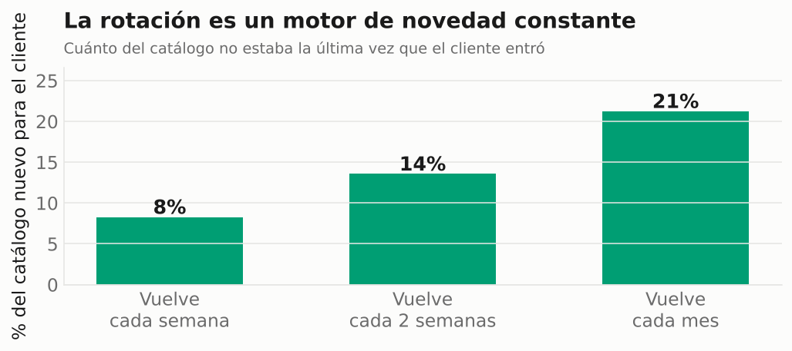
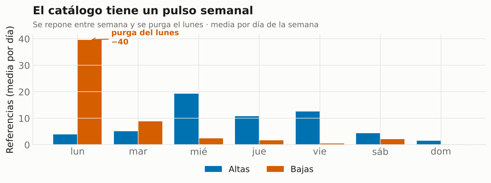

# Rescue Planner — estudio de rotación de catálogo

Un supermercado convencional decide su catálogo y luego compra para sostenerlo.
Un supermercado de excedentes hace lo contrario: el catálogo es lo que **resulta**
de lo que aparece cada semana. Eso convierte el surtido en una variable de salida,
no en un punto de partida, y cambia por completo cuál es la decisión difícil del
negocio.

Este repositorio mide esa dinámica con datos públicos y extrae de ahí insights de
negocio: cómo se etiqueta y se precia el excedente, cómo se concentran los
proveedores, y a qué ritmo rota el surtido.

**Estado:** análisis de catálogo operativo (recolección + taxonomía, precios, rotación y proveedores). Serie diaria recogida de forma autónoma desde el 14-ago-2026.

---

## Los hallazgos en una imagen

Todo lo de abajo sale de **54 días de serie diaria** del catálogo público
(14-ago → 6-oct-2026), recogidos sin intervención. Reproducible con
`python dashboard.py`.

### 1 · El catálogo es inventario vivo



El surtido no es un punto de partida estable: oscila entre ~490 y ~540
referencias según lo que entra y sale cada semana. En un supermercado de
excedente, el catálogo es una variable de salida, no de entrada.

### 2 · Entra y sale producto todas las semanas



Unas 55-60 referencias nuevas por semana, y otras tantas que desaparecen. Es
flujo constante, no un catálogo que se llena una vez.

### 3 · La mitad del surtido se renueva en ~4-5 semanas



De las 513 referencias presentes el primer día, en 53 días desapareció el 27 %.
Esta es la medición **rigurosa** de la rotación: altas y bajas observadas día a
día, no estimadas desde fechas de publicación.

### 4 · El motivo del excedente marca el precio



El precio sigue dos palancas distintas. Entre los motivos de **excedente real**
(azul) hay un gradiente de urgencia claro: cuanto antes caduca o menos recuperable
es el producto, mayor el descuento (Fecha corta 28 % > Rescate 21 % > Excedente
15 %). **Innovación** (morado) es otra cosa: lanzamientos de producto nuevo —
incluso no alimentario— con descuento de introducción, no urgencia. Y toda esta
lógica sólo se puede aplicar al tercio del catálogo que declara su motivo
(ver `HALLAZGOS.md`, H1-H2).

### 5 · Surtido atomizado, pero inclinado a marcas grandes



94 proveedores distintos, ninguno dominante — pero más de la mitad del catálogo
viene de una veintena, y entre los mayores pesan marcas conocidas. Conviven dos
relatos: el del rescate de pequeños productores y el del ahorro en marca grande.

### 6 · La rotación es un motor de novedad constante



La otra cara comercial de la rotación: un cliente que vuelve cada mes se encuentra
con un 21 % del catálogo que no estaba la última vez. Material de recompra que se
genera solo — y, a la vez, un riesgo de retención cuando desaparece un favorito.

### 7 · El catálogo tiene un pulso semanal



La rotación no es uniforme: tiene un ritmo operativo semanal. Entre semana se
repone (picos de altas miércoles-viernes) y los **lunes hay una purga de ~40
referencias**. El catálogo crece hacia el fin de semana —cuando la gente compra—
y se limpia al empezar la semana. Sólo visible con la serie diaria.

---

## Qué hay aquí

| Módulo | Qué hace | Datos | Estado |
|---|---|---|---|
| **Taxonomía** | Cobertura del motivo de excedente, política de precios implícita, calidad de campos | **Reales**, endpoint público | ✅ |
| **Radar** | Snapshot diario; rotación, altas/bajas, descuento efectivo, supervivencia de referencias | **Reales**, endpoint público | ✅ recolectando |
| **Cohortes** | Antigüedad del surtido reconstruida desde `published_at` (con sus cautelas) | **Reales**, endpoint público | ✅ |
| **Proveedores** | Concentración, calidad del campo `vendor` y perfil por proveedor | **Reales**, endpoint público | ✅ |


## Origen de los datos

`https://www.remolonas.com/products.json` — endpoint público y estándar de
Shopify, el mismo que sirve al buscador de la propia tienda. Una petición al día,
`robots.txt` comprobado antes de cada ejecución, User-Agent identificable con
contacto. No se republica el catálogo íntegro: el repositorio publica métricas
agregadas y la serie temporal necesaria para reproducirlas.

## Arranque

```bash
git clone <este-repo> && cd remolonas-rescue-planner
pip install -r requirements.txt

# edita USER_AGENT en snapshot.py y pon tu email real
python snapshot.py --dry-run     # comprueba que responde
python snapshot.py               # primer snapshot
python taxonomia.py              # funciona con UN solo día
python radar.py                  # necesita ≥2 días para altas/bajas
python cohortes.py               # rotación reconstruida desde published_at
python proveedores.py            # concentración y calidad del campo vendor
python productos.py              # cobertura de peso y categoría
python dashboard.py              # regenera los gráficos de docs/ desde la base
```

Para la recolección diaria, activa el workflow de GitHub Actions
(`.github/workflows/snapshot.yml`): corre a las 06:15 UTC y commitea el resultado.
Alternativa local, si prefieres no depender de Actions:

```cron
15 8 * * *  cd /ruta/al/repo && /usr/bin/python3 snapshot.py >> data/cron.log 2>&1
```

## Reproducibilidad (Docker)

El análisis no depende de la versión de Python ni del sistema: sólo usa la
librería estándar más matplotlib (gráficos) y pytest (tests), con versiones
pineadas en `requirements.txt`. Para garantizarlo en cualquier máquina:

```bash
docker build -t remolonas-rescue-planner .
docker run --rm remolonas-rescue-planner
```

Por defecto el contenedor **reconstruye la base desde los crudos, corre los tests
y regenera los gráficos** — la cadena completa, reproducida de cero.

Qué garantiza y qué no: Docker fija el *entorno* y hace que `rebuild`, `tests` y
`dashboard` den un resultado idéntico partiendo de los `.json.gz` versionados.
Lo único no determinista es `snapshot.py`, porque sale a la web en vivo y el
catálogo cambia cada día — por eso la fuente de verdad son los crudos, no la
captura.

## Por qué la base de datos no está en git

`data/catalog.sqlite` es un binario. Si lo versionas y lo escriben dos sitios —
tu portátil y el runner de Actions — antes o después hay un conflicto que git no
sabe resolver y hay que tirar una de las dos versiones.

Los `.json.gz` no tienen ese problema: uno por día, escritos una vez, nunca
tocados de nuevo. Así que **la fuente de verdad son los crudos** y la base es un
derivado: `python rebuild.py` la regenera, `python rebuild.py --check` verifica
que coincide. Misma idea que versionar un lockfile en vez de `node_modules`.

## Nota metodológica: censura

La métrica que más apetece citar —"una referencia dura X días en catálogo"— es la
más fácil de calcular mal. Al principio de la serie casi todas las referencias
están **censuradas por la derecha**: siguen vivas cuando dejas de mirar, así que
su duración observada es una cota inferior, no su duración real. Y las que ya
estaban el primer día están censuradas por la izquierda: nunca viste su alta.

Promediar todo junto da un número más bajo que la realidad y con una seguridad
que no existe. `radar.py` separa explícitamente ambos grupos, y a partir de 14
días calcula **Kaplan-Meier**, que sí usa correctamente la información de las
observaciones censuradas.

Consecuencia práctica: **no cites la vida media hasta tener tres semanas de serie.**

## Estructura

```
snapshot.py                  recolector
taxonomia.py                 análisis transversal (1 snapshot basta)
radar.py                     métricas de rotación (serie temporal)
cohortes.py                  rotación hacia atrás desde published_at
proveedores.py               concentración, calidad y perfil por proveedor
productos.py                 peso y categoría inferidos, con cobertura medida
dashboard.py                 genera los gráficos de docs/ desde la base
rebuild.py                   reconstruye la base desde data/raw/
Dockerfile · Makefile        entorno reproducible y atajos (make all)
HALLAZGOS.md                 bitácora de resultados, con sus cautelas
docs/*.png                   gráficos de los hallazgos (embebidos arriba)
tests/test_pipeline.py       16 tests, sin red
data/raw/*.json.gz           JSON crudo diario — FUENTE DE VERDAD, versionado
data/catalog.sqlite          derivado reconstruible, NO versionado
```


## Limitaciones conocidas

- El endpoint público expone el catálogo visible, no el stock real ni las unidades
  disponibles. La rotación medida es de **surtido**, no de inventario.
- `available` en Shopify puede reflejar configuración de la tienda, no existencias.
- **Confirmado el 14-ago-2026:** la caja de fruta y verdura NO se publica como
  referencias individuales — son 2 variantes con tag `rm_caja`. Todo el análisis
  describe la Tienda Remolona (despensa), no la caja de fresco. Es la limitación
  más seria del proyecto.
- **Confirmado el 14-ago-2026:** `product_type` no es informativo (99,6 % del
  catálogo comparte valor) y `available` tampoco (99,6 % disponible). La
  taxonomía explotable está en `tags`. Ver `HALLAZGOS.md`.
